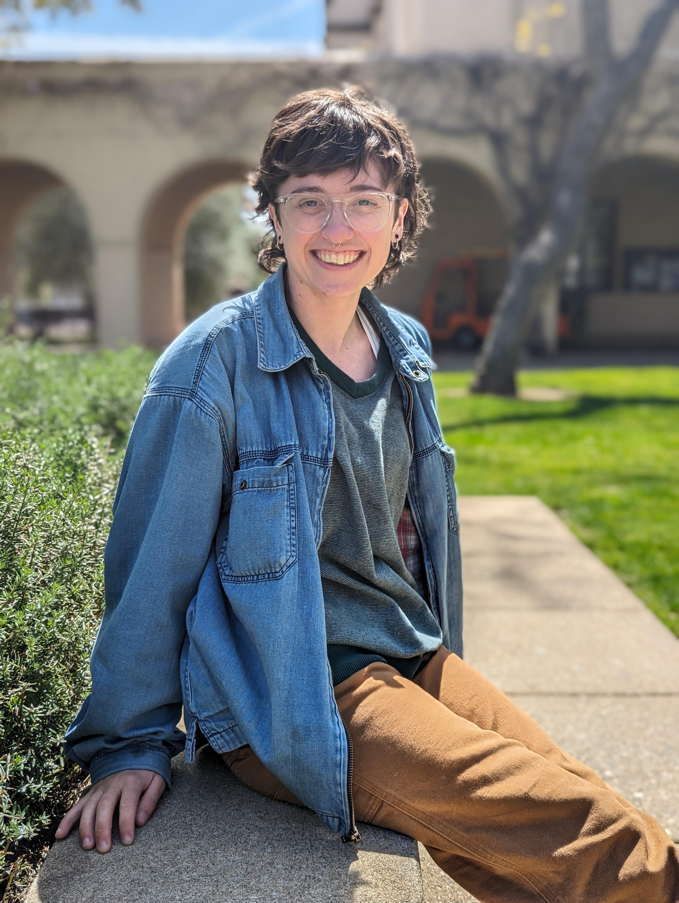

I am a fifth (and final) year Ph.D Candidate in Physics at the California Institute of Technology (**Caltech**), advised by [Dr. Katerina Chatziioannou](https://kchatziioannou.github.io/index.html) and studying the **spins of merging binary black hole systems with gravitational-wave data** from the Laser Interferometer Gravitational-wave Observatory (**LIGO**).
I am broadly interested in how, when, and why we can infer properties of celestial compact objects like black holes and neutron stars, from both a **statistical** and **astrophysical** standpoint, as well as in **teaching and building a more inclusive, supportive culture in physics academia that serves the public good**.

*Research:* My Ph.D research focuses the measurability of the **spins of binary black holes** through their **gravitational-wave emission** for individual systems and their astrophysical population. 
I have studied ... 

&nbsp;

You can learn more about my research interests [here](/research/), and read my publications [here](/publications/).

&nbsp;

*Teaching and Mentoring:* I am passionate about teaching and mentoring undergraduate scientists.
My mentoring philosophy centers on providing consistent, individually-tailored intra- and extra-curricular guidance and creating strong, community-based support structures. My skills and outlook stem from extensive experience with one-on-one mentorship, advocacy for increased representation, and leadership in community-building projects such as Caltech's graduate student and postdoc [union](caltechgpu.org/).

&nbsp;

You can read more about my mentoring philosophy [here](/mentoring/2025/04/10/example.html) and relevant experience [here](/teaching-mentoring-outreach/).

&nbsp;

*Retrospective:* I graduated summa cum laude from Smith College in 2020 with a Bachelor's in Physics, minor in Mathematics, and [thesis](https://scholarworks.smith.edu/theses/2305/) with highest honors. Before coming to Caltech in 2021, I then spent a year researching gravitational waves from rapidly rotating neutron stars in Germany at the Max Planck Institute for Gravitational Physics (also known as the Albert Einstein Institute) under a Fulbright Research Scholarship. 

&nbsp;

Feel free to reach out via email at `smiller@caltech.edu`.