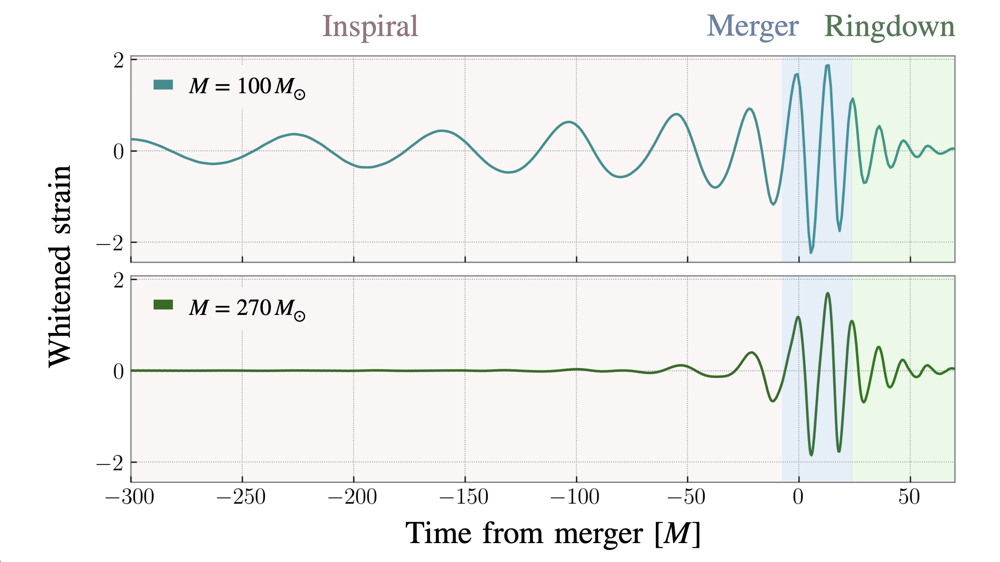
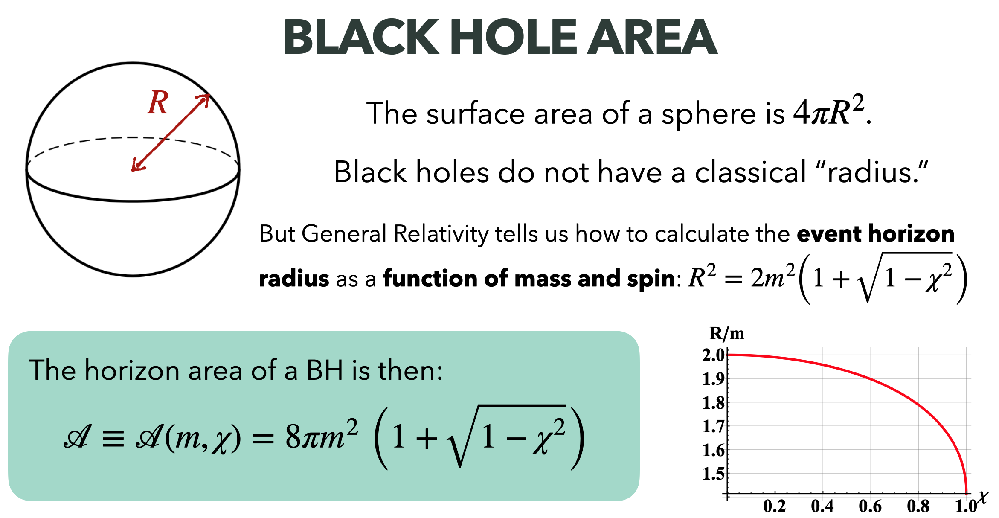
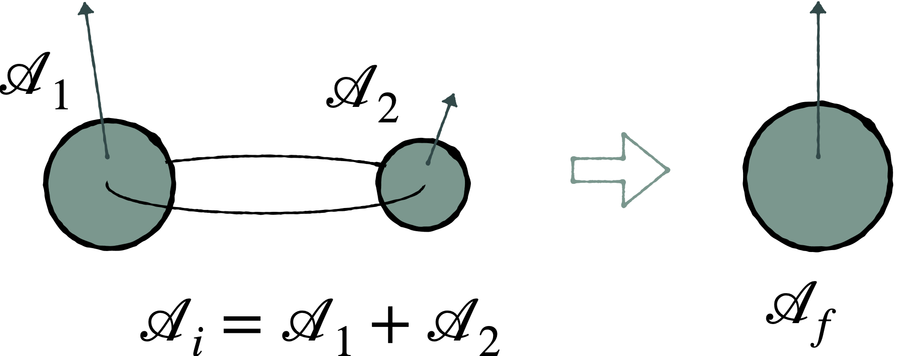
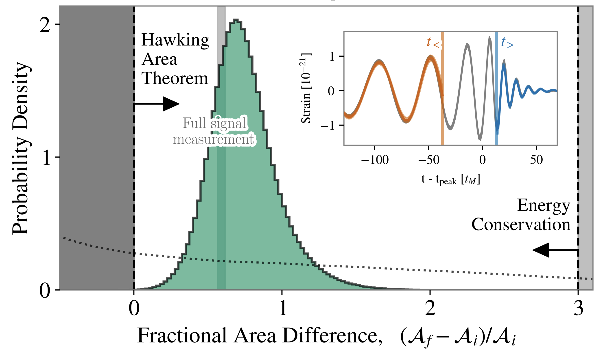

Throughout our universe, pairs of **black holes** with masses between ~5--100 times that of our sun orbit each other for millions of years. 
These binary black holes (BBHs) lose energy via the emission of **gravitational waves** (GWs): ripples in the fabric of space-time itself that propagate outwards at the speed of light. 
The energy loss causes the two black holes to spiral inwards towards one-another, until they merge in the cosmos' most extreme collisions: in a fraction of a second, one BBH merger releases over ten times more energy than all of the starlight in the observable universe!

The morphology---or signal amplitude and phase over time---of the GWs emitted by these BBH mergers is predicted by Einstein's theory of General Relativity and depends on the source's properties: its masses, spins, distance, orientation, etc.

    

     
      Figure 1: Schematic of  masses, spin magnitudes, and spin tilt angles of a BBH.
     
    

 

\
Over the last decade, the [Laser Interferometer Gravitational-wave Observatory](https://www.ligo.caltech.edu/) (**LIGO**), along with Virgo and KAGRA, have detected *hundreds* of GW signals from coalescing BBHs. 
This global network of detectors is made up of giant ground-based interferometers which use lasers to measure GW-induced changes in length one trillion times smaller than a proton, making them the most sensitive instruments ever created. 

**I am interested in how, when, and why we can measure subtle effects in gravitational-wave signals, from both an astrophysical and statistical standpont.**
Much of my work focuses on the **spins** of black holes, also known as their intrinsic angular momenta.
Spin is a crucial probe of the astrophysical origin of BBHs, and yet is notoriously difficult to constrain via gravitational waves, *especially* in signals from the **high-mass** BBHs which fall at the edge of LIGO's sensitivity.
I want to answer questions like: 

\
★ *How do precessing spins imprint on the gravitational waves we observe from high-mass binary black holes, which are dominated by the non-linear merger regime?* 

\
★ *What can post-merger data tell us about pre-merger dynamics?* 

\
★ *What non-astrophysical phenomena can mimic spins and how do we distinguish between real and spurious measurements?*

\
★ *On a population-level, how can we improve the robustness of spin measurements through better statistical model-checking procedures?* 

\
And more! Under each heading below, I describe some of my specific research projects in more detail.

    
 Spinning Heavy Binary Black Holes 

    

To make robust measurements of the properties of BBHs observed via GWs, I posit that is essential to **connect measured parameters**, i.e, masses and spins, **with waveform phenomenology**, or how these parameters imprint onto observable GW signals.
This connection is especially crucial for BBHs ~ 100 solar masses: because they merge at lower frequencies, these systems fall near the lower edge of LIGO's sensivity band and thus only generate a few dectable GW cycles, as seen in Figure 2. 
This does not give us much data with which to infer over a dozen source parameters. 
If one of these few waveform cycles happens to overlap with a detector glitch (or non-Gaussian noise transient), a substantial amount of the data are compromised. 
Moreover, the observable cycles fall predominantly in the late inspiral and merger regime which remain the least-understood as they rely on numerical---rather than analytic---modeling.

    

     
      Figure 2: Comparison of GW signals from a lower- versus higher-mass BBH. The inspiral, merger, and ringdown regimes of data are each highlighted different colors. The higher-mass signal barely has any observable inspiral.
     
    

 

The elusiveless of parameter estimation in high-mass signals is exacerbated for parameters that are already hard to model and measure in the first place, like spin precession caused by misalignment between spin and orbital angular momentum (see Figure 1).
Here, the precession timescale is longer than the signal duration itself, making it difficult to distinguish from other physical phenomena like eccentricity. 
Without a thorough understanding of the observable imprint of BH spins, spurious measurements could come from small fluctuations in detector noise, data quality issues, waveform systematics, or unmodeled physics, risking false astrophysical conclusions. 

I have conducted thorough investigations of spin-measurability in high-mass BBHs using a technique called **time-domain inference**.
By slicing GW data over a series of times and analyzing them independently before and after each truncation, I trace the imprint of spin precession (and other effects) on each GW cycle. 
Our time-domain inference code, [`tdinf`](https://github.com/simonajmiller/tdinf), is publically available on `github` with tutorials and examples.

I applied time-domain on the massive and highly-precessing event [GW190521](https://arxiv.org/abs/2310.01544) to localize the precession measurement to the interplay between a quiet final inspiral cycle and a loud merger (see Figure 3).
This suppression of the final inspiral cycle happens because the direction of maximal GW emission away sweeps from our line of sight as the binary precesses. 

    

     
      Figure 3: Animation of the evolution of the spin precession measurement (quantified with chi_p) and resultant waveform reconstructions over cutoff time in GW190521.
     
    

 

My co-authors and I have applied this technique to other events, [GW191109](https://arxiv.org/abs/2409.03912)---whose anti-aligned spin measurement is concurrent with a glitch in the inspiral data---and GW231123---the most massive BBH yet which is inferred to be very highly spinning (analysis in prep). 
I have also looked at a suite of [simulated high-mass signals](https://arxiv.org/abs/2505.14573), and have curiously discovered that the same waveform features do not always drive spin measurements. For systems with *identical underlying spin dynamics*, whether or not precession is *observable* depends on the total mass and full angular orientation in the sky: in some configurations, precession’s imprint is visible in just the pre- or post-merger alone, while others require specific waveform cycles or their interplay, as was the case for GW190521. 

My work highlights that extreme caution must be taken when inferring subtle effects in GW data: interesting spin configurations do not always stem from analogous waveform morphology, and can be easily [biased](https://arxiv.org/abs/2510.05029) by non-astrophysical effects like detector noise.

    
 Probing Fundamental Physics with GWs 

    

Time-domain inference (see *Spinning Heavy Binary Black Holes* section above) can be used not just to generate trustworthy spin measurements, but also to test fundamental physics like **Hawking's Area Law**---also known as the second law of black hole dynamics. The "area" of a black hole is described below in Figure 4a.

    

     
      Figure 4a: Schematic explanation for calculating the the area of a black hole. The plot shows how the spin affects the black hole's "radius", and therefore the area.
     
    

 

Hawking's Area Law states that **the black hole horizon area must decrease over time**. When applied to a binary black hole system, this means that the sum of the areas of the two initial, progenitor black holes must be *smaller* than the area of the final, remnant black hole. 

    

     
      Figure 4b: Schematic for the initial and final black hole areas. Hawking's Area Law states that A1 + A2 < Af.
     
    

 

Truncating the data in time and analyzing the inspiral and merger regimes separately allows for independent measurements of the initial and final black hole masses and spins, and thus areas. I apply this technique to GW250114, the loudest merger LIGO has observed yet with a signal-to-noise ratio (SNR) of 80. Even its inspiral data alone have a higher SNR than any other observed full signal. (I am quoted in [IFL Science](https://www.iflscience.com/an-unimaginable-breakthrough-loudest-ever-gravitational-wave-collision-proves-stephen-hawking-correct-80760) talking about this historic detection!) 
GW250114's strain and mass/spin posteriors are shown in Figure 5.

    

     
      Figure 5: Initial and final mass and spin constraints for GW250114, when the full signal (black empty) or just the inspiral (orange) or ringdown (green) was analyzed.
     
    

 

Combining these mass and spin measurements using the boxed equation in Figure 4a produces a measurement on the initial and final areas. 
To test whether the initial area (Ai) is smaller than the final area (Af), we take their fractional different (Af-Ai)/Ai, and find the confidence level at which the quantity is greater than zero.
The result is shown in Figure 6, with a fractional area posterior than exluded 0 at over 4-sigma confidence.
This is the first-ever direct observational confirmation of Hawking’s Area Law.

    

     
      Figure 6: Fractional area difference constraint for the BBH that generated GW250114, and corresponding waveform resconstructions from just the inspiral data (orange) and ringdown data (blue). Figure taken from [GW250114 detection paper](https://journals.aps.org/prl/abstract/10.1103/kw5g-d732).
     
    

 

<!--

    
 Population Analyses 

    

boop

-->

  
   

*This page was last updated November 21, 2025.*